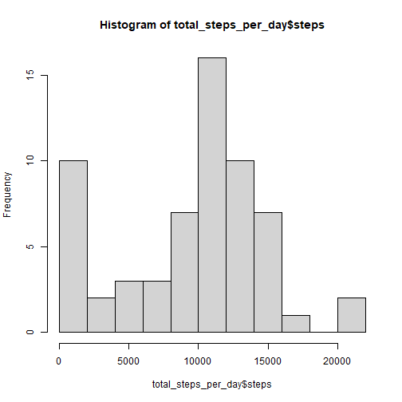
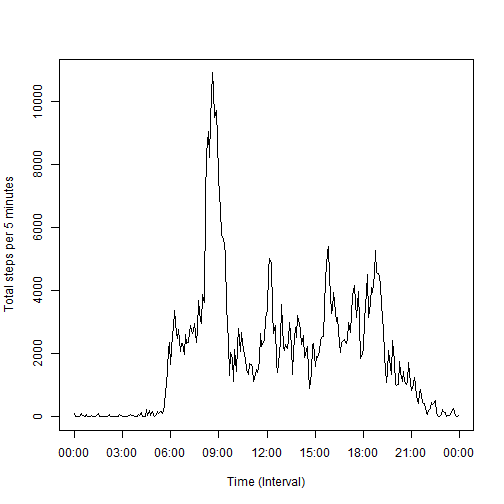
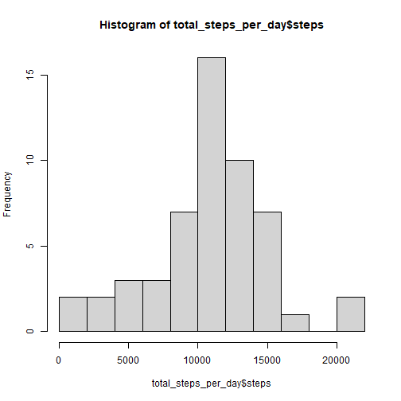
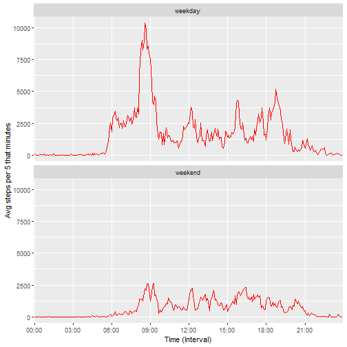

## Loading and preprocessing the data

``` r
#Loading libraries
library(dplyr)
library(tidyverse)
library(ggplot2)
library(lubridate)

#Load the data 
df <- read.table(unz("activity.zip", "activity.csv"), header=T, sep=",")
```


## What is mean total number of steps taken per day?

``` r
# For this part of the assignment, you can ignore the missing values in the dataset.

#1. Calculate the total number of steps taken per day

total_steps_per_day <- df %>%
        summarise(steps_per_day = sum(steps, na.rm = T), .by = date)
print(head(total_steps_per_day))
```

```
##         date steps_per_day
## 1 2012-10-01             0
## 2 2012-10-02           126
## 3 2012-10-03         11352
## 4 2012-10-04         12116
## 5 2012-10-05         13294
## 6 2012-10-06         15420
```


``` r
#2. If you do not understand the difference between a histogram and a barplot, research the difference between them. Make a histogram of the total number of steps taken each day
hist(x = total_steps_per_day$steps, include.lowest = T, breaks = 8)
```




``` r
#3. Calculate and report the mean and median of the total number of steps taken per day
print(paste('Median:',median(total_steps_per_day$steps, na.rm = T)))
```

```
## [1] "Median: 10395"
```

``` r
print(paste('Mean:', mean(total_steps_per_day$steps, na.rm = T)))
```

```
## [1] "Mean: 9354.22950819672"
```


## What is the average daily activity pattern?

``` r
#Data set preparing 
total_steps_per_5min <- df %>%
        summarise(steps_per_day = sum(steps, na.rm = T), .by = interval)

int2char <- function(x){
        x <- as.character(x)
        if (nchar(x)==1){
                x <- paste0('000', x)
        } else if(nchar(x)==2){
                x <- paste0('00', x)                
        } else if(nchar(x)==3){
                x <- paste0('0', x)
        }
        x <- paste0(substring(x, 1, 2),
                   ':',
                   substring(x, 3, 4))
        x
}

total_steps_per_5min$interval <- sapply(X = total_steps_per_5min$interval, int2char)

print(head(total_steps_per_5min))
```

```
##   interval steps_per_day
## 1    00:00            91
## 2    00:05            18
## 3    00:10             7
## 4    00:15             8
## 5    00:20             4
## 6    00:25           111
```

``` r
# Make a time series plot (i.e. type = "l") of the 5-minute interval (x-axis) and the average number of steps taken, averaged across all days (y-axis)

plot(x = as.numeric(row.names(total_steps_per_5min)), 
     y = total_steps_per_5min$steps, type = 'l',
     xaxt = "n", xlab = 'Time (Interval)', ylab = 'Total steps per 5 minutes') 
axis(1, 
     at=c(seq(1, 288, 36), c(288+1)), 
     labels=total_steps_per_5min$interval[c(seq(1, 288, 36), c(1))])
```




``` r
# Which 5-minute interval, on average across all the days in the dataset, contains the maximum number of steps?

max_n_of_steps <- max(total_steps_per_5min$steps_per_day)

max_n_of_steps_interval <- total_steps_per_5min[total_steps_per_5min$steps_per_day == max_n_of_steps, 'interval']

print(paste('5-minute interval, on average across all the days in the dataset, containing the maximum number of steps is:', max_n_of_steps_interval))
```

```
## [1] "5-minute interval, on average across all the days in the dataset, containing the maximum number of steps is: 08:35"
```


## Imputing missing values

``` r
# Note that there are a number of days/intervals where there are missing values (coded as NA). The presence of missing days may introduce bias into some calculations or summaries of the data.
# 1. Calculate and report the total number of missing values in the dataset (i.e. the total number of rows with NAs)
print(paste('Total number of NA in "steps" column -', sum(is.na(df$steps))))
```

```
## [1] "Total number of NA in \"steps\" column - 2304"
```

``` r
print(paste('Total number of NA in "date" column -', sum(is.na(df$date))))
```

```
## [1] "Total number of NA in \"date\" column - 0"
```

``` r
print(paste('Total number of NA in "interval" column -', sum(is.na(df$interval))))
```

```
## [1] "Total number of NA in \"interval\" column - 0"
```


``` r
#Devise a strategy for filling in all of the missing values in the dataset. The strategy does not need to be sophisticated. For example, you could use the mean/median for that day, or the mean for that 5-minute interval, etc.

# Let's fill NAs with the "mean for that 5-minute interval"

median_for_that_day <- df %>%
        group_by(interval) %>%
        mutate(mean_for_that_interval = mean(steps, na.rm = T)) %>%
        ungroup()

rows_na <- which(is.na(df$steps))
median_for_that_day$steps[rows_na] <- median_for_that_day$mean_for_that_interval[rows_na]

print(head(median_for_that_day))
```

```
## # A tibble: 6 × 4
##    steps date       interval mean_for_that_interval
##    <dbl> <chr>         <int>                  <dbl>
## 1 1.72   2012-10-01        0                 1.72  
## 2 0.340  2012-10-01        5                 0.340 
## 3 0.132  2012-10-01       10                 0.132 
## 4 0.151  2012-10-01       15                 0.151 
## 5 0.0755 2012-10-01       20                 0.0755
## 6 2.09   2012-10-01       25                 2.09
```


``` r
#Create a new dataset that is equal to the original dataset but with the missing data filled in.
df_no_na <- median_for_that_day[,1:3]
print(head(df_no_na))
```

```
## # A tibble: 6 × 3
##    steps date       interval
##    <dbl> <chr>         <int>
## 1 1.72   2012-10-01        0
## 2 0.340  2012-10-01        5
## 3 0.132  2012-10-01       10
## 4 0.151  2012-10-01       15
## 5 0.0755 2012-10-01       20
## 6 2.09   2012-10-01       25
```


``` r
# Make a histogram of the total number of steps taken each day and Calculate and report the mean and median total number of steps taken per day. Do these values differ from the estimates from the first part of the assignment? What is the impact of imputing missing data on the estimates of the total daily number of steps?

total_steps_per_day <- df %>%
        summarise(steps_per_day = sum(steps), .by = date)

hist(x = total_steps_per_day$steps, include.lowest = T, breaks = 8)
```



``` r
print(paste('Median:',median(total_steps_per_day$steps, na.rm = T)))
```

```
## [1] "Median: 10765"
```

``` r
print(paste('Mean:', mean(total_steps_per_day$steps, na.rm = T)))
```

```
## [1] "Mean: 10766.1886792453"
```

``` r
print('These values differ from the estimates from the first part of the assignment')
```

```
## [1] "These values differ from the estimates from the first part of the assignment"
```

``` r
print('Bias bias into caused by NAs has been eliminated')
```

```
## [1] "Bias bias into caused by NAs has been eliminated"
```

## Are there differences in activity patterns between weekdays and weekends?


``` r
#Create a new factor variable in the dataset with two levels – “weekday” and “weekend” indicating whether a given date is a weekday or weekend day.

df_no_na$weekdays <- as.character(wday(as.Date(df_no_na$date), week_start = 1))

what_day_is_it <- function(x){
        if (x %in% as.character(1:5)){
                x <- "weekday"
        } else {
                x <- "weekend"
        }
        x
}

df_no_na$weekdays <- as.factor(sapply(X = df_no_na$weekdays, FUN = what_day_is_it))

print( df_no_na[sample(nrow(df_no_na), size = 10),] )
```

```
## # A tibble: 10 × 4
##    steps date       interval weekdays
##    <dbl> <chr>         <int> <fct>   
##  1   0   2012-10-04     1915 weekday 
##  2  48   2012-10-21      635 weekend 
##  3   0   2012-10-26      415 weekday 
##  4   0   2012-10-22     1005 weekday 
##  5   0   2012-11-19     1225 weekday 
##  6   0   2012-11-11      425 weekend 
##  7 168   2012-10-19     1650 weekday 
##  8  37.5 2012-11-14     1755 weekday 
##  9   0   2012-11-08     1145 weekday 
## 10   0   2012-11-16     1230 weekday
```

``` r
# Make a panel plot containing a time series plot (i.e.  type = "l") of the 5-minute interval (x-axis) and the average number of steps taken, averaged across all weekday days or weekend days (y-axis). See the README file in the GitHub repository to see an example of what this plot should look like using simulated data.

#data processing
total_steps_per_5min_wd <- df_no_na %>%
        group_by(weekdays, interval) %>%
        mutate(avg_steps_per_interval = sum(steps)) %>%
        ungroup() %>%
        distinct(weekdays, interval, avg_steps_per_interval) 

# int2char function(x) has been determined above
total_steps_per_5min_wd$interval <- sapply(X = total_steps_per_5min_wd$interval, int2char)

#Dataset for plotting
total_steps_per_5min_wd_pivot <- 
        total_steps_per_5min_wd %>% 
        pivot_wider(names_from = weekdays, values_from = avg_steps_per_interval)
head(total_steps_per_5min_wd_pivot)
```

```
## # A tibble: 6 × 3
##   interval weekday weekend
##   <chr>      <dbl>   <dbl>
## 1 00:00     101.     3.43 
## 2 00:05      20.0    0.679
## 3 00:10       7.79   0.264
## 4 00:15       8.91   0.302
## 5 00:20       4.45   0.151
## 6 00:25      71.6   56.2
```


``` r
#Plotting: 

new_labels <- total_steps_per_5min_wd_pivot$interval[c(seq(1, 288, 36), c(1))]

total_steps_per_5min_wd <- total_steps_per_5min_wd[, 1:3]
        
#total_steps_per_5min_wd_pivot
p1 <- ggplot(data = total_steps_per_5min_wd,
            aes(interval, avg_steps_per_interval, group = 1))
p2 <- p1 + facet_wrap(.~weekdays, nrow = 2 , ncol = 1) +
        scale_x_discrete(breaks = new_labels) +
        xlab('Time (Interval)') + 
        ylab('Avg steps per 5 that minutes')
p3 <- p2 + geom_line(color = 'red')
p3
```



 
